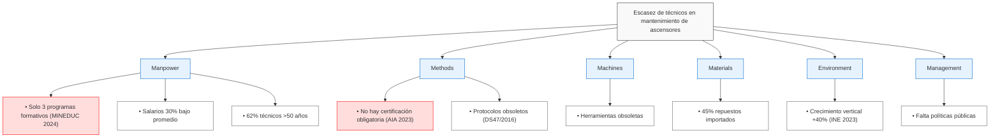

```mermaid
graph TD
    A[Escasez de técnicos en mantenimiento de ascensores] --> B[Manpower]
    A --> C[Methods]
    A --> D[Machines]
    A --> E[Materials]
    A --> F[Environment]
    A --> G[Management]

    %% Manpower (Personal)
    B --> B1["• Solo 3 programas formativos (MINEDUC 2024)"]
    B --> B2["• Salarios 30% bajo promedio"]
    B --> B3["• 62% técnicos >50 años"]

    %% Methods (Métodos)
    C --> C1["• No hay certificación obligatoria (AIA 2023)"]
    C --> C2["• Protocolos obsoletos (DS47/2016)"]

    %% Machines (Equipos)
    D --> D1["• Herramientas obsoletas"]

    %% Materials (Materiales)
    E --> E1["• 45% repuestos importados"]

    %% Environment (Entorno)
    F --> F1["• Crecimiento vertical +40% (INE 2023)"]

    %% Management (Gestión)
    G --> G1["• Falta políticas públicas"]

    %% Estilo
    classDef root fill:#f9f9f9,stroke:#333;
    classDef category fill:#e6f3ff,stroke:#0066cc;
    classDef cause fill:#fff,stroke:#666;
    class A root;
    class B,C,D,E,F,G category;
    class B1,B2,B3,C1,C2,D1,E1,F1,G1 cause;
    style B1 fill:#ffdddd,stroke:#ff0000
    style C1 fill:#ffdddd,stroke:#ff0000
```
